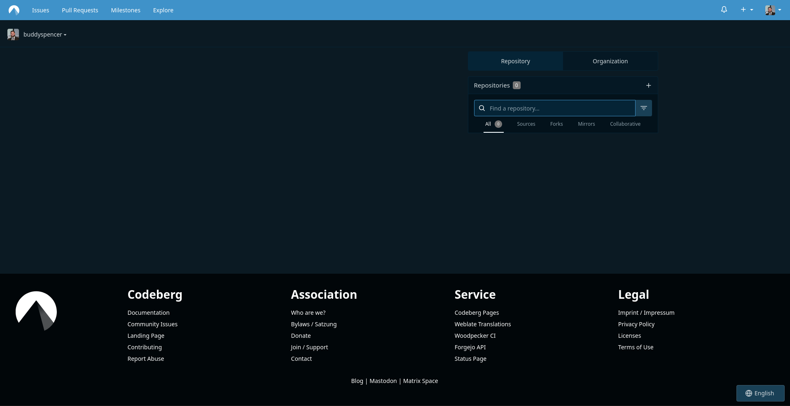
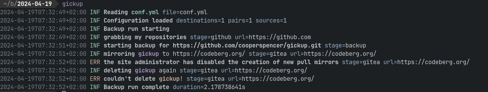
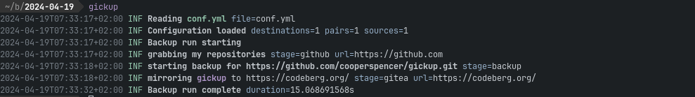
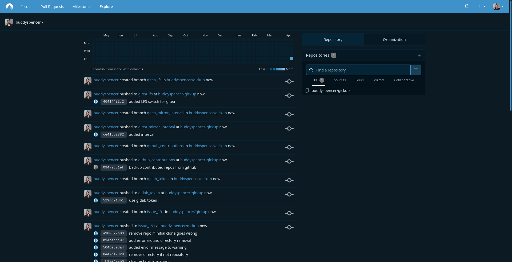

[Codeberg](https://codeberg.org) is an alternative to Github, powered by open source. They use [Forgejo](https://forgejo.org), which is also developed by them.

By default, the mirroring feature is disabled on Codeberg, but with the latest changes in Gickup you can still mirror your repository to Codeberg.
For this example, I'll try to mirror gickup to Codeberg.

As for now, I have no repositories on Codeberg.


First of all we need to create a token for Gickup.
"Read and Write" for user and repository should suffice.


This configuration will show that mirrors are disabled by default.
```yaml title=conf.yml
source:
  github:
    - include: ["gickup"]
destination:
  gitea:
    - url: https://codeberg.org/
      token: <Top Secret>
```

Here is the error message.



Let's fix the configuration.
```yaml title=conf.yml
source:
  github:
    - include: ["gickup"]
destination:
  gitea:
    - url: https://codeberg.org/
      token: <Top Secret>
      mirror:
        enabled: true
```

The second attempt looks way better.


Gickup is now **mirrored** to Codeberg.
